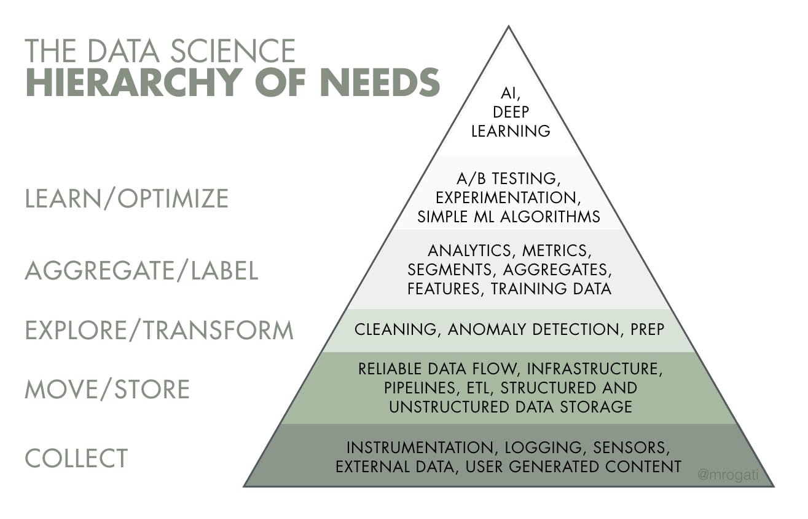

# Data Engineering learning material

## Intro
- https://www.youtube.com/watch?v=qWru-b6m030 - introductory video

## Roadmap
- https://github.com/datastacktv/data-engineer-roadmap - use as general guidance

## Python
- https://gto76.github.io/python-cheatsheet/ - Python cheatsheet
- https://www.scrapingbee.com/blog/web-scraping-101-with-python/ - Web scraping with Python
- https://pandas.pydata.org/Pandas_Cheat_Sheet.pdf - Pandas cheatsheet
- https://pandas.pydata.org/pandas-docs/stable/user_guide/cookbook.html - Pandas cookbook
- https://github.com/satwikkansal/wtfpython - Python quirks
- https://cjolowicz.github.io/posts/hypermodern-python-01-setup - Modern Python tooling
- https://superfastpython.com/python-concurrency-choose-api/ - Choose the right Python concurrency API
- https://miguelgfierro.com/blog/2018/a-beginners-guide-to-python-testing/ - intro to testing

## SQL
- https://i.redd.it/g79fnqndd6s71.jpg - cheatsheet
- https://calpaterson.com/how-a-sql-database-works.html - data structures of a database
- https://aneesh.mataroa.blog/blog/vectorization-in-olap-databases/ - quick article on vectorization
- https://www.youtube.com/watch?v=Cym4TZwTCNU - Rich Hickey: Deconstructing the Database
- https://muratbuffalo.blogspot.com/2022/09/sqlite-past-present-and-future.html - SQLite architecture
- https://extendsclass.com/mysql-online.html - MySQL playground
- https://www.youtube.com/channel/UCuDWqzSSHgHkD0zBwrIXSNQ/playlists - SQL problems and solutions
- https://towardsdatascience.com/the-sql-unit-testing-landscape-2023-7a8c5f986dd3 - SQL Unit Testing landscape in 2023

## Linux & tooling
- https://github.com/jlevy/the-art-of-command-line - Bash commands

## Distributed Systems/System design/Architecture
- https://www.youtube.com/watch?v=Y6Ev8GIlbxc - intro
- https://pdos.csail.mit.edu/6.824/schedule.html - MIT module on Distributed Systems
- https://www.youtube.com/playlist?list=PLeKd45zvjcDFUEv_ohr_HdUFe97RItdiB - Distributed Systems series by Martin Kleppmann
- https://www.computer.org/publications/tech-news/research/netflix-chaos-engineering - Chaos
- https://asatarin.github.io/testing-distributed-systems/
- https://github.com/binhnguyennus/awesome-scalability
- https://github.com/donnemartin/system-design-primer
- https://github.com/ByteByteGoHq/system-design-101
- https://github.com/codecrafters-io/build-your-own-x
- https://martinfowler.com/architecture/
- https://martinfowler.com/articles/patterns-of-distributed-systems/
- https://martinfowler.com/articles/microservices.html
- https://github.com/DovAmir/awesome-design-patterns

## Compiled lists
- https://github.com/sindresorhus/awesome
- https://github.com/igorbarinov/awesome-data-engineering
- https://github.com/papers-we-love/papers-we-love
- https://github.com/dwmkerr/hacker-laws
- https://github.com/trimstray/the-book-of-secret-knowledge

## Data mesh
- https://martinfowler.com/articles/data-monolith-to-mesh.html
- https://martinfowler.com/articles/data-mesh-principles.html
- https://carlosgrande.me/my-data-mesh-thesis/

## Misc articles/blogs/news/discussions/videos
- https://refactoring.guru/ - refactoring and design patterns
- https://www.youtube.com/watch?v=Fvu2oFyFCT0 - *meta* data engineering
- https://maximebeauchemin.medium.com/functional-data-engineering-a-modern-paradigm-for-batch-data-processing-2327ec32c42a ; https://www.youtube.com/watch?v=4Spo2QRTz1k - *functional* data engineering
- https://github.com/hemanth/functional-programming-jargon - functional programming intro
- https://www.youtube.com/watch?v=pzfgbSfzhXg - build *frameworks* not pipelines
- https://www.youtube.com/watch?v=ZZr9oE4Oa5U - *stages* of data engineering
- https://preset.io/blog/reshaping-data-engineering/ - data engineering trends
- https://airbyte.io/blog/why-the-future-of-etl-is-not-elt-but-el - EL(T) over ELT
- https://databand.ai/blog/a-data-observability-model-for-data-engineers/ - data observability
- https://discord.com/blog/how-discord-stores-billions-of-messages - Discord case study
- https://discord.com/blog/how-discord-stores-trillions-of-messages - Follow up to the above
- https://zwischenzugs.com/2022/08/08/who-should-write-the-terraform/ - Who Should Write the Terraform?
- https://blog.twitter.com/engineering/en_us/a/2013/dremel-made-simple-with-parquet - Dremel (BigQuery) behind the scenes
- https://www.blef.fr/tag/datanews/ - data news
- https://www.startdataengineering.com/post/ - brief "how to" posts
- https://medium.com/better-programming/why-domain-driven-design-203099adf32a - Why DDD
- https://motherduck.com/blog/big-data-is-dead/ - Big Data is Dead
- https://artem.krylysov.com/blog/2023/04/19/how-rocksdb-works/ - How RocksDB works

## Reddit discussions
- **https://www.reddit.com/r/dataengineering/comments/r14k34/which_tech_skills_are_the_most_marketable_in_the/hlwohpr/**
- https://www.reddit.com/r/dataengineering/comments/pmtenl/data_warehouse_interview_question/
- https://www.reddit.com/r/dataengineering/comments/rnmumx/kimball_vs_inmon_vs_vault/
- https://www.reddit.com/r/dataengineering/comments/paid71/best_practices_to_orchestrate_ingestion_into/ha52vu2/ (also check another [comment](https://www.reddit.com/r/dataengineering/comments/q77329/no_work_in_team_what_to_learn_work_on/hggu1yd/) from the same person)
- https://www.reddit.com/r/dataengineering/comments/rkhevl/what_did_you_guys_wish_you_knew_before/hpa41ff/
- https://www.reddit.com/r/dataengineering/comments/q1i98c/python_or_sql_for_etl_or_both/hfgl7fy/
- https://www.reddit.com/r/dataengineering/comments/r6lhgq/late_data_arrival/

## Tech companies' engineering blogs
- https://github.com/kilimchoi/engineering-blogs
- https://github.blog/category/engineering/
- https://engineering.linkedin.com/blog
- https://eng.uber.com/
- https://netflixtechblog.com/
- https://blog.twitter.com/engineering/en_us
- https://discord.com/category/engineering

## Team structure
- https://medium.com/snaptravel/how-should-our-company-structure-our-data-team-e71f6846024d - different structures for data teams
- https://handbook.gitlab.com/ - Gitlab handbook
- Team Topologies: Organizing Business and Technology Teams for Fast Flow

## Missing Semester of Your CS Education
- https://missing.csail.mit.edu/

## Technical books and relevant resources
- Introduction to Algorithms
- Designing Data-Intensive Applications
- The Data Warehouse Toolkit
- Design Patterns: Elements of Reusable Object-Oriented Software
- https://github.com/tayllan/awesome-algorithms (Algorithms)
- https://medium.com/@Joker3D/mind-maps-of-designing-data-intensive-application-2b7556be92b3 (DDIA)
- https://www.holistics.io/blog/how-to-read-data-warehouse-toolkit/ (DW Toolkit)
- https://www.kimballgroup.com/data-warehouse-business-intelligence-resources/kimball-techniques/dimensional-modeling-techniques/ (DW Toolkit)
- https://github.com/faif/python-patterns (Design Patterns)
- https://github.com/practical-tutorials/project-based-learning

## Career articles
- https://web.archive.org/web/20220222135436/https://www.justindfuller.com/2022/02/embracing-impostor-syndrome/
- https://dsebastien.net/blog/2022-08-03-the-feynman-technique
- https://bitfieldconsulting.com/golang/career
- https://www.bti360.com/what-ive-learned-in-45-years-in-the-software-industry/
- https://sloanreview.mit.edu/article/top-performers-have-a-superpower-happiness/
- https://www.simplethread.com/20-things-ive-learned-in-my-20-years-as-a-software-engineer/

## Interview
- https://github.com/viraptor/reverse-interview
- https://github.com/yangshun/tech-interview-handbook
- https://github.com/donnemartin/interactive-coding-challenges
- https://github.com/jwasham/coding-interview-university
